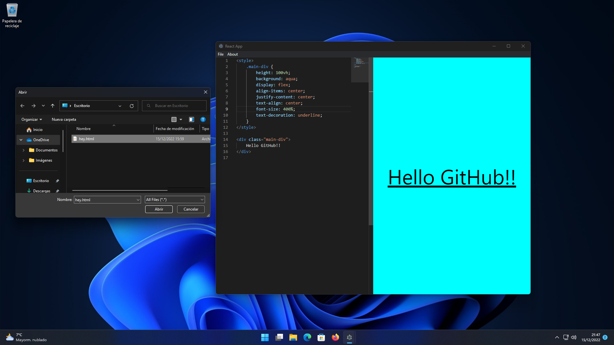
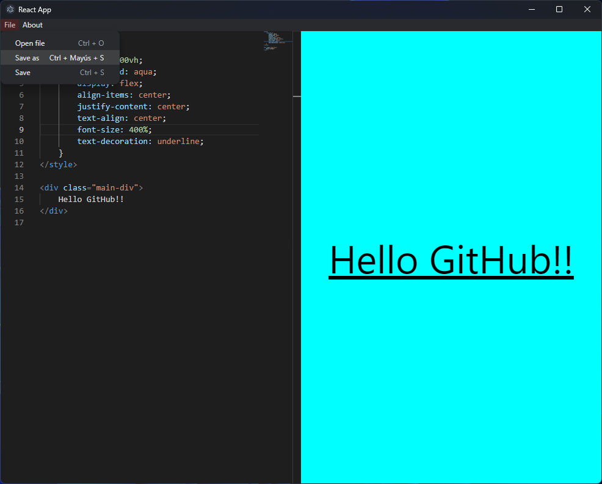

# Electron & React HTML viewer
## Screenshots



___ 

<br/>

## Instalation:
- With the default installer: [download installer.exe file](https://www.mediafire.com/file/fpxuxxed4xnu7ki/installer.exe/file)
- Creating your own installer:
```shell
$ git clone https://github.com/chemokita13/html-editor-viewer_electron
$ cd html-editor-viewer_electron
$ npm install
$ npm start-forge
$ npm package
$ cd out
```
And run the .exe file

